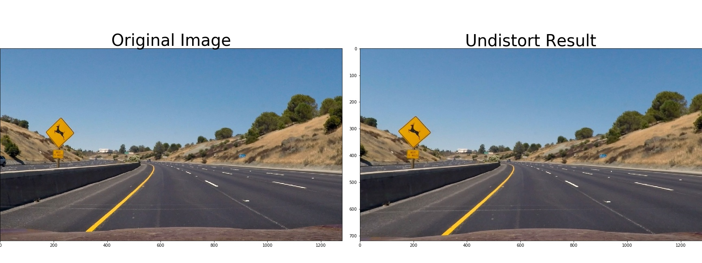
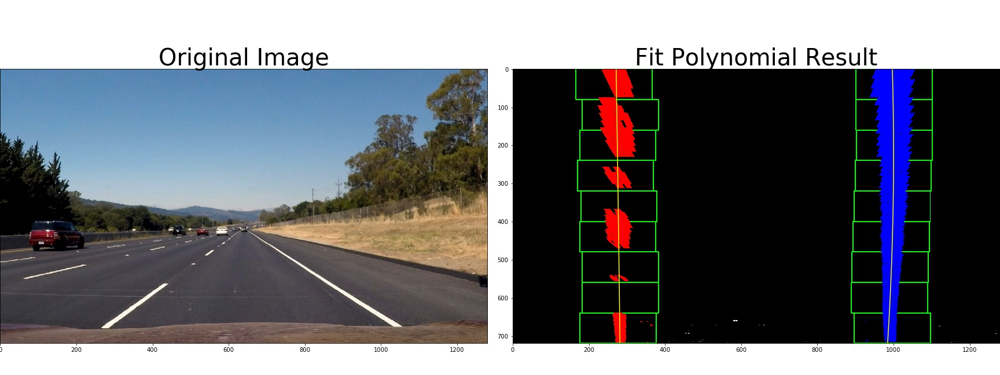

## Advanced Lane Finding Project

The goals / steps of this project are the following:

* Compute the camera calibration matrix and distortion coefficients given a set of chessboard images.
* Apply a distortion correction to raw images.
* Use color transforms, gradients, etc., to create a thresholded binary image.
* Apply a perspective transform to rectify binary image ("birds-eye view").
* Detect lane pixels and fit to find the lane boundary.
* Determine the curvature of the lane and vehicle position with respect to center.
* Warp the detected lane boundaries back onto the original image.
* Output visual display of the lane boundaries and numerical estimation of lane curvature and vehicle position.

---

### Camera Calibration

#### 1. Computing the camera matrix and distortion coefficients.

The code for this step is implemented in 2nd cell of `pipeline(single).ipynb`.

I start by preparing "object points", which will be the (x, y, z) coordinates of the chessboard corners in the world. Here I am assuming the chessboard is fixed on the (x, y) plane at z=0, such that the object points are the same for each calibration image.  Thus, `objp` is just a replicated array of coordinates, and `objpoints` will be appended with a copy of it every time I successfully detect all chessboard corners in a test image.  `imgpoints` will be appended with the (x, y) pixel position of each of the corners in the image plane with each successful chessboard detection.

I then used the output `objpoints` and `imgpoints` to compute the camera calibration and distortion coefficients using the `cv2.calibrateCamera()` function (3rd cell in `pipeline(single).ipynb`).  I applied this distortion correction to the test image using the `cv2.undistort()` function and below are some results:


### Pipeline (single images)

#### 1. An example of a distortion-corrected image.
After I got the camera matrix `mtx` and distortion coefficients `dist`, I use the `cv2.undistort()` function to undistort the test images (4th cell in `pipeline(single).ipynb`). Below are some results:




#### 2. Using color transforms, gradients or other methods to create a thresholded binary image.
I used a combination of color and gradient thresholds to generate a binary image (5th & 6th cell in `pipeline(single).ipynb`).  Here's two examples of my output for this step.


#### 3. Performing a perspective transform.

I firstly define  a source(`src`) and a destination(`dst`) points array. Then I use the `cv2.getPerspectiveTransform()` function to compute the perspective transform `M` and the inverse perspective transform `Minv`. The code appears in the 7rd code cell of the IPython notebook `pipeline(single).ipynb`.  I chose the hardcode the source and destination points in the following manner:

```
offsetx = 280    # x dim offset for dst points
offsety = 0      # y dim offset for dst points
src = np.float32([(597, 449), (687, 449), (239, 703), (1086, 703)])
dst = np.float32([
    [offsetx, offsety], [img_size[0] - offsetx, offsety],
    [offsetx, img_size[1] - offsety],
    [img_size[0] - offsetx, img_size[1] - offsety]
])
```

This resulted in the following source and destination points:

| Source        | Destination   |
|:-------------:|:-------------:|
| 597, 449      | 280, 0        |
| 687, 449      | 1000, 0       |
| 239, 703      | 280, 720      |
| 1086, 703     | 1000, 720     |

I verified that my perspective transform was working as expected by drawing the `src` and `dst` points onto a test image and its warped counterpart to verify that the lines appear parallel in the warped image (8th code cell of the `pipeline(single).ipynb`). Here are two examples of my output this step.


#### 4. Identifying lane-line pixels and fit their positions with a polynomial.

I first take a histogram with the `binary_wrapped` images, then I separately find the left and right peak of the histogram as the base points of the left and right lane line. Then I use 9 sliding windows, placed around the line centers, to find and follow the lines up to the top of the frame from the base points. Then I use the detected lines pixel positions as the input of `np.polyfit()` function to get polynomial coefficients of each line. The code appears in 9th & 10th code cell of `pipeline(single).ipynb`. Here are two examples of my output this step.




#### 5. Calculating the radius of curvature of the lane and the position of the vehicle with respect to center.

I did this in 11th code cell in `pipeline(single).ipynb`.

To calculate the radius of curvature of the lane, I use the equation showed in Lesson 18.

To calculate the position of the vehicle with respect to center, I assume that the camera is set in the center of the vehicle, so the center position of the car in every original image is (640, 720). If we ignore y coordinate value, the center position of car (640)  to the bottom center of perspective transform plane defined by `src` (662.5) is less than 22.5. So in the `binary_wrapped` image, the center position of car equals `640 - (22.5 * 720/ (1086 - 239))` which results 621. So we can use this new position to compare with the detected left and right lane lines position to calculate how far the vehicle left/right of lane center.

####6. An example image of my result plotted back down onto the road such that the lane area is identified clearly.

I implemented this step in 12th code cell in `pipeline(single).ipynb`. Here are two examples of my result on test images:


---

###Pipeline (video)

I use `video_pipeline.py` and `image_process.py` to process the images in the video.

I combine every step used in test images into the `video_pipeline.py` while the `image_process.py` implements some function used in `video_pipeline.py`.

---

###Discussion

#### Some problems / issues I faced in implementation of this project.

When the car is moving to where there is a large area of shadow or where the color of road is different from previous, this pipeline will fail. In the `project_video.mp4`, when car drives through the bridges or where there are some trees on the roadside, the pipeline can't detect lane correctly.

To make the pipeline more robust, I take 2 methods.

- Track the differents of polynomial coefficients between current frame and last frame. if its sum of squares larger than 200, then mark as Lane Line is not detected. In the next frame of video, use the `fit_polynomial` function (use sliding windows) rather than just search in a margin around the previous line position to find lane lines and fit polynomial. The code appears in line 86 & line 142-154 in my code file `video_pipeline.py`.
- Use the polynomial coefficients averaged over the last 5 frames (include current fitted frame) as polynomial coefficients of the this frame, and use it to plot the lane area. The code appears in line 129-159 and line 174-175 in my code file `video_pipeline.py`.

